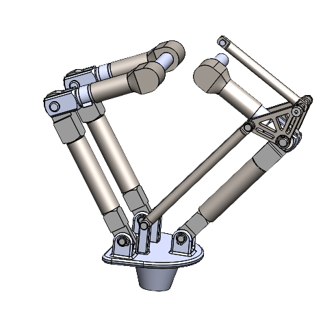

<!-- Improved compatibility of back to top link: See: https://github.com/othneildrew/Best-README-Template/pull/73 -->

<!--
*** Thanks for checking out the Best-README-Template. If you have a suggestion
*** that would make this better, please fork the repo and create a pull request
*** or simply open an issue with the tag "enhancement".
*** Don't forget to give the project a star!
*** Thanks again! Now go create something AMAZING! :D
-->

<!-- PROJECT SHIELDS -->
<!--
*** I'm using markdown "reference style" links for readability.
*** Reference links are enclosed in brackets [ ] instead of parentheses ( ).
*** See the bottom of this document for the declaration of the reference variables
*** for contributors-url, forks-url, etc. This is an optional, concise syntax you may use.
*** https://www.markdownguide.org/basic-syntax/#reference-style-links
-->
[![Contributors][contributors-shield]][contributors-url]
[![Forks][forks-shield]][forks-url]
[![Stargazers][stars-shield]][stars-url]
[![Issues][issues-shield]][issues-url]
[![MIT License][license-shield]][license-url]

<!-- PROJECT LOGO -->
 

  

  <h3 align="center">SPIF-A_v2</h3>

  

  It consists of the development of an incremental stamping machine   
   
    <a href="https://github.com/TatianaResend/SPIFA-e-v2.0"><strong>Explore the docs »</strong></a>
     
     
    <a href="https://github.com/TatianaResend/SPIFA-e-v2.0/blob/main/README.md">View Demo</a>
    ·
    <a href="https://github.com/TatianaResend/SPIFA-e-v2.0/issues">Report Bug</a>
    ·
    <a href="https://github.com/TatianaResend/SPIFA-e-v2.0/issues">Request Feature</a>
  

<!-- TABLE OF CONTENTS -->

  
Table of Contents

  <ol>
    <li>
      <a href="#about-the-project">About The Project</a>
      <ul>
        <li><a href="#base-requirements">Base requirements</a></li>
        <li><a href="#architecture">Architecture</a></li>
        <li><a href="#simulation">Simulation</a></li>
      </ul>
    </li>
    <li><a href="#contributing">Contributing</a></li>
    <li><a href="#license">License</a></li>
    <li><a href="#contact">Contact</a></li>
    <li><a href="#acknowledgments">Acknowledgments</a></li>
  </ol>

<!-- ABOUT THE PROJECT -->
# About The Project
The project serves as the focal point of the master's thesis in mechanical engineering. The primary goal of this project is to develop a compact incremental forming machine. The machine will be electric, ensuring a silent operation and compact size to facilitate coexistence with 3D printers. To effectively cover all aspects of machine construction, the project has been divided into three key areas: machine structure design, mechanical project, and automation project.

<!-- GETTING STARTED -->
# Machine structure design

## Base requirements:

|  |  |
| --- | --- |
| Number of axels | 3 |
| Working area  | 200 x 200 mm  |
| Vertical stroke  | 100 mm  |
| Sheet thickness  | 0,5 to 3 mm |
| Sheet material   | aluminum |
| Conformation forces | 3 kN (vert.) 1 kN (hor.) |
| Motors           | Nema 34 |

## Architecture

The study of possible configurations is demonstrated in issues [#1](/../../issues/1) to [#4](/../../issues/4). After the analysis it is concluded that the best configuration is case 1.1.1..
To choose the best configuration, the lowest possible torque was taken into account.

- 2 arms in parallel (delta 2)
- Distance between motors: 50 mm
- L1 = 120;
- L2 = 150;
- y _ work area = -320 mm
- Maximum torque: 665 Nm 

## Direct and indirect kinematic analysis:
The direct and indirect kinematics are represented in the issue [#16](/../../issues/16) and in chapter 3.3 of the thesis document.

# Mechanical project
Mechanical projects steps:
- Arm design
- Support system for the forming punch
- Selection and sizing of the motor-reducer set
- Selection and sizing of the linear motor-autorator set
- Structural configuration
- Simulation

# Automation project
- Wiring diagram and main components
- Motion Control
- SPIF-A_v2 GUI

<!-- CONTRIBUTING -->
# Contributing

If you have a suggestion that would make this better, please fork the repo and create a pull request. You can also simply open an issue with the tag "enhancement".
Don't forget to give the project a star! Thanks again!

1. Fork the Project
2. Create your Feature Branch (`git checkout -b feature/AmazingFeature`)
3. Commit your Changes (`git commit -m 'Add some AmazingFeature'`)
4. Push to the Branch (`git push origin feature/AmazingFeature`)
5. Open a Pull Request

(<a href="#readme-top">back to top</a>)

<!-- LICENSE -->
# License

Distributed under the GPL License. See `LICENSE.txt` for more information.

(<a href="#readme-top">back to top</a>)

<!-- CONTACT -->
# Contact

Tatiana Resende - tatianaresende@ua.pt

Project Link: [SPIF-A_v2](https://github.com/TatianaResend/SPIFA-e-v2.0)

 <!-- 
(<a href="#readme-top">back to top</a>)
 -->

<!-- ACKNOWLEDGEMENTS -->
### Acknowledgements
- Professor Ricardo Sousa - rsousa@ua.pt
- Professor Daniel Afonso - dan@ua.pt

(<a href="#readme-top">back to top</a>)

<!-- MARKDOWN LINKS & IMAGES -->
<!-- https://www.markdownguide.org/basic-syntax/#reference-style-links -->
[contributors-shield]: https://img.shields.io/github/contributors/TatianaResend/SPIF-A_v2.svg?style=for-the-badge
[contributors-url]: https://github.com/TatianaResend/SPIF-A_v2/contributors
[forks-shield]: https://img.shields.io/github/forks/TatianaResend/SPIF-A_v2.svg?style=for-the-badge
[forks-url]: https://github.com/TatianaResend/SPIF-A_v2/network/members
[stars-shield]: https://img.shields.io/github/stars/TatianaResend/SPIF-A_v2.svg?style=for-the-badge
[stars-url]: https://github.com/TatianaResend/SPIF-A_v2/stargazers
[issues-shield]: https://img.shields.io/github/issues/TatianaResend/SPIF-A_v2.svg?style=for-the-badge
[issues-url]: https://github.com/TatianaResend/SPIF-A_v2/issues
[license-shield]: https://img.shields.io/github/license/TatianaResend/SPIF-A_v2.svg?style=for-the-badge
[license-url]: https://github.com/TatianaResend/SPIF-A_v2/blob/master/LICENSE.txt
